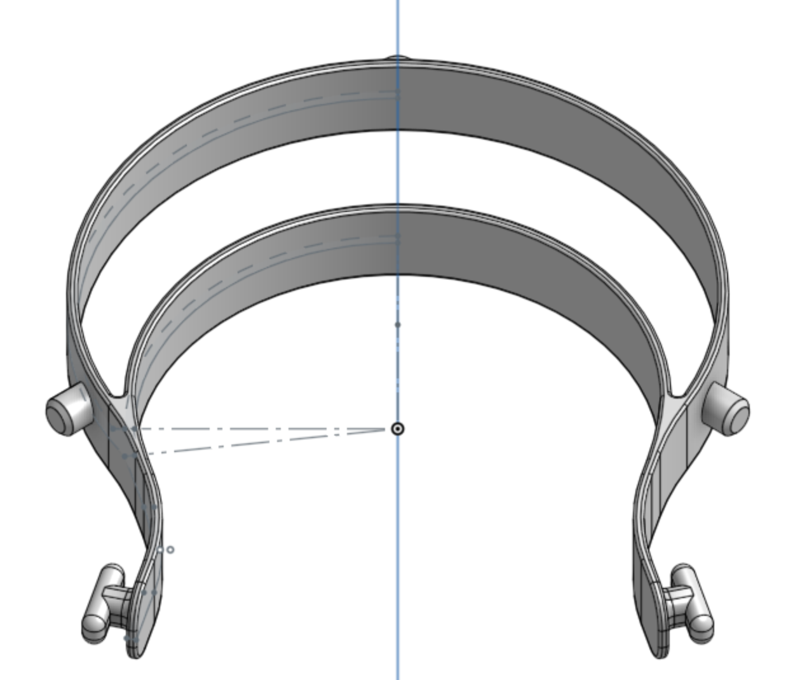
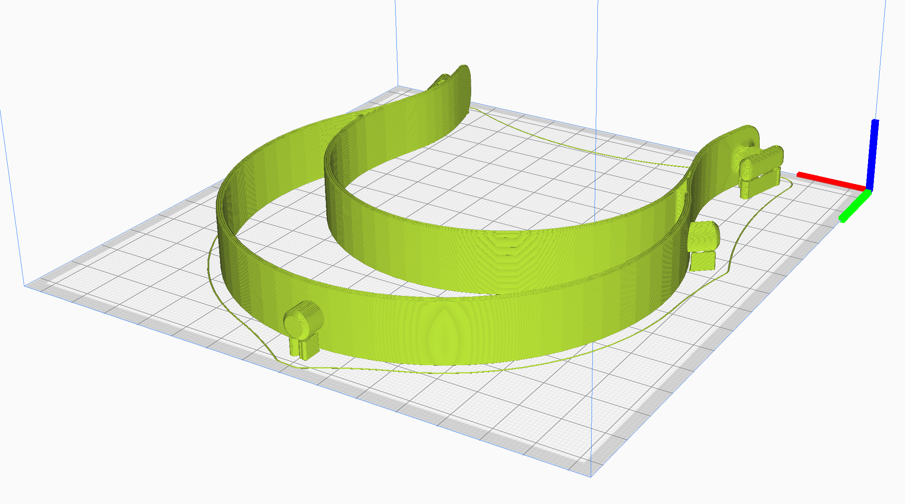

# COVID19

## Motivation

The Cambridge Health Alliance is [soliciting PPE donations](https://www.challiance.org/about/newsroom/personal_protective_equipment_ppe_donations_1179), and MGH wants [3D printed masks](https://www.nbcboston.com/news/coronavirus/mgh-desperately-needs-supplies-president-says/2094292/).

3D printing masks and respirators is [sketchy at best](https://blog.prusaprinters.org/from-design-to-mass-3d-printing-of-medical-shields-in-three-days/) so it looks like glasses and face shields are a much better plan.

Prusa has a [great face shield design](https://www.youtube.com/watch?v=pP7z3iw76GA), as does [Budmen Industries](https://budmen.com/). It seems like Budmen is a good platform to coordinate through, though I would prefer to talk straight to local hospitals and nurses so that I can produce the highest impact goods.

I think there's a fairly high chance that none of these get used. The need for masks is definitely way more critical than shields, and shields can probably be wiped down and reused much more effectively. But CHA is actively asking for them, and this is very low cost to me, so I'll take the gamble. I am currently healthy and have some 3D printers, and a passing interest in manufacturing, so let's give this a shot.

## Goals

Produce PPE and other emergency equipment for local hospitals who have run out of official equipment.

Attempt to produce the highest impact goods, as determined by

* Hospital need
* Likeliness to work (be safe and effective)

## Face Shields

I'm going to start with face shields because they seem like a superset of safety glasses. My goal is to produce around 200 units, but this may change after making initial deliveries and getting feedback on current needs.

### Capital equipment

* [X] FDM printer with 130mm x 130mm bed
* [X] [Standard three hole punch](https://www.amazon.com/Swingline-Precision-Adjustable-Capacity-74037/dp/B0006HUPHU) (or single hole punch + jig)

### Consumables

* [X] [ABS plastic](https://www.amazon.com/gp/product/B00J0H6NNM) (16g per part, or 21g with raft) (white preferred to show contamination)
* [X] [Overhead transparency film](https://www.amazon.com/gp/product/B07F45YXJD) (1 sheet)
* [X] [Elastic strap for back](https://www.amazon.com/gp/product/B07KSRCLKK) (9 inches if tying knots at the ends)
* [ ] [Gallon ziploc bag](https://www.amazon.com/gp/product/B07BJ495GL) (packaging for final product and prevent contamination) (1 bag)

*Note: These are all links to Amazon. I have acquired the materials locally when possible. I have also put in an order for a larger quantity of supplies, but deliveries are quite slow right now. I was able to get the transparency sheets and elastic cord from [Blick art supplies](https://www.dickblick.com/) who were wonderful and took my order over the phone and handed it to me outside their storefront.*

### Design

* [Onshape Link](https://cad.onshape.com/documents/dcd6ca254672a123c702e56e/w/8bd6e5bff2b92adb0a930074/e/4d12b3a488c49a6203e14760)
* [Download STL](face_shield_headband.stl)

The basic design will be the same as others are doing: a 3D-printed headpiece secured by elastic, which holds a transparent sheet by means of three holes in the sheet.

I wish I could just use the Budmen design, but it will not fit in my print bed. I have created a clone of the Prusa RC1 design with slight changes to improve ergonomics and to suit my process.

### Manufacturing

I can only fit one part on my 3D printer at a time. The bottom surface is unimportant so a raft is probably not necessary. Maybe I can stack them vertically.

### Sterilization

I was originally going to bake the product at a [low temperature](https://www.who.int/csr/sars/survival_2003_05_04/en/) in its final packaging, but it seems like all of the parts *except the plastic ziploc bag* can withstand baking at 100°C. I think the best I will be able to do is to wear gloves and a face shield when doing the final packaging step, with no further sterilization attempts.

### Delivery

I don't have a car but I have a bike trailer!

## Safety Glasses

I'm definitely starting with masks, but once that line is up and running I'll probably design some glasses.

I see a few benefits to glasses:

* Less material use (can produce more with limited resources)
* Faster turn time
* CHA is explicitly asking for them, unlike face masks

but we'll see how things play out over the next week or so.

## Warranty / Legal

All of the content here is public domain (see license file.)

I do not warrant these designs, products, or reference material for any particular purpose. It is up to the end user to assess their efficacy / correctness. If you're in the business of persuing legal action against ordinary people trying to produce lifesaving equipment during a pandemic, fuck you.
