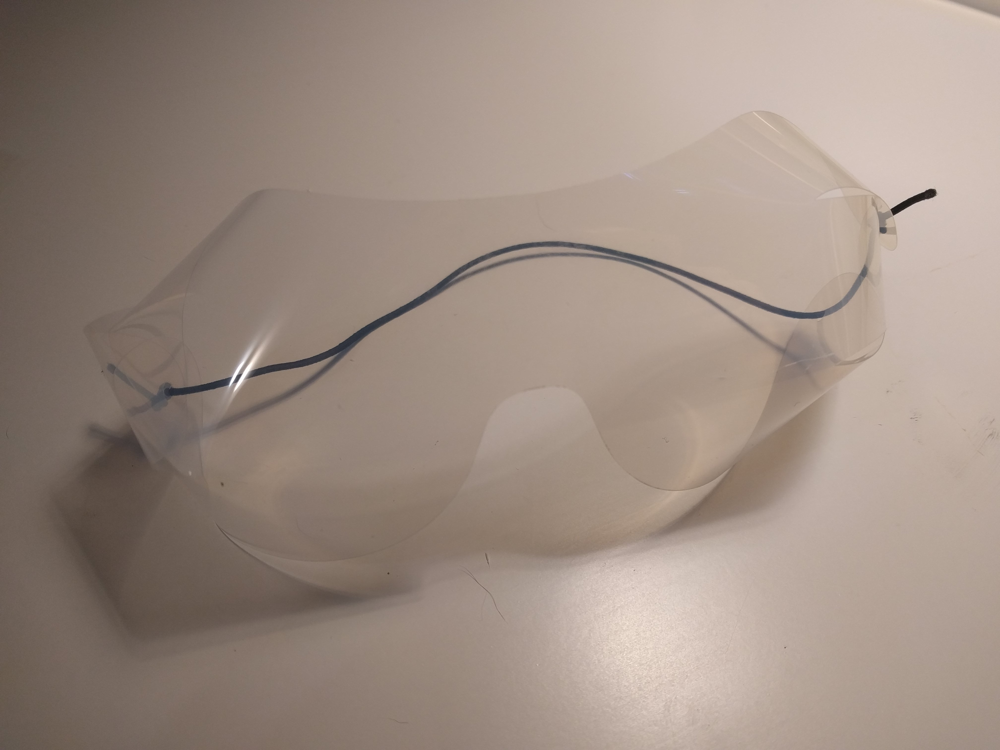

# COVID19

Public domain designs for improvised PPE

## Motivation

The Cambridge Health Alliance is [soliciting PPE donations](https://www.challiance.org/about/newsroom/personal_protective_equipment_ppe_donations_1179), and MGH wants [3D printed masks](https://www.nbcboston.com/news/coronavirus/mgh-desperately-needs-supplies-president-says/2094292/).

My goal is to produce PPE and other emergency equipment for local hospitals who have run out of official equipment.

I will attempt to produce the highest impact goods, as determined by

* Hospital need
* Likeliness to work (be safe and effective)

I think there's a fairly high chance that none of these get used. The need for masks is definitely way more critical than basically anything else. But CHA is actively asking for things like goggles, and this is very low cost to me, so I'll take the gamble. I am currently healthy and have some 3D printers, and a passing interest in manufacturing, so let's give this a shot.

## Face Shields

[Face shields page](shields.md)

## Goggles

[Goggles page](goggles.md)

## Warranty / Legal

All of the content here is public domain (see license file.)

I do not warrant these designs, products, or reference material for any particular purpose. It is up to the end user to assess their efficacy / correctness. If you're in the business of persuing legal action against ordinary people trying to produce lifesaving equipment during a pandemic, fuck you.
