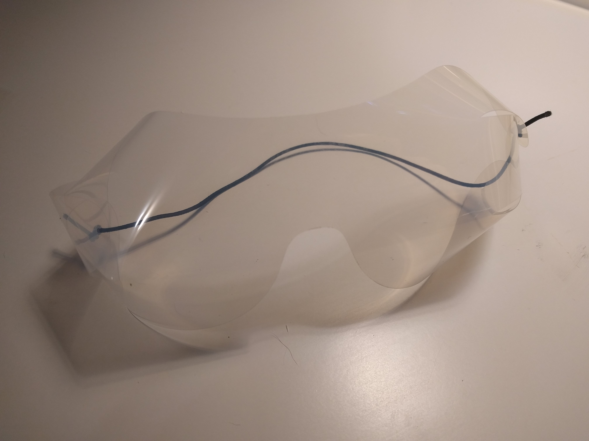
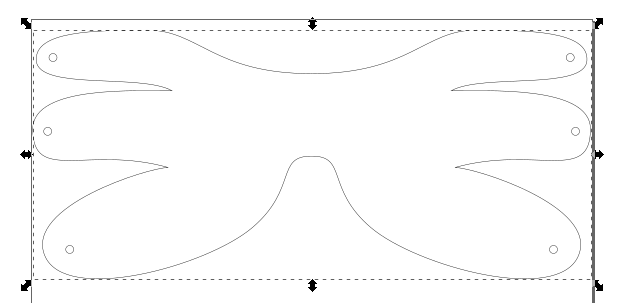

# Safety goggles

Safety goggles are probably not as effective as full-face shields, but consume less material and are much faster to produce.

I see a few benefits to glasses:

* Less material use (can produce more with limited resources)
* Faster turn time
* CHA is explicitly asking for them

but we'll see how things play out over the next week or so.

This design is inspired by skydiving goggles, which are made in much the same way. They are not the most comfortable, but are quite good at keeping air out
(they are by no means airtight, though.)

This design requires no special equipment to produce.

## Capital equipment

* [X] [Vinyl cutter](https://www.amazon.com/Silhouette-America-Portrait-2/dp/B009GZUPFA) (optional)

## Consumables

* [X] [Overhead transparency film](https://www.amazon.com/gp/product/B07F45YXJD) (1 sheet)
* [X] [Elastic strap for back](https://www.amazon.com/gp/product/B07KSRCLKK) (10 inches)
* [X] [Quart ziploc bag](https://www.amazon.com/Ziploc-Storage-Quart-Bags-Count/dp/B019ZTZTVQ/) (packaging for final product and prevent contamination) (1 bag)

*Note: These are all links to Amazon. I have acquired the materials locally when possible. I have also put in an order for a larger quantity of supplies, but deliveries are quite slow right now. I was able to get the transparency sheets and elastic cord from [Blick art supplies](https://www.dickblick.com/) who were wonderful and took my order over the phone and handed it to me outside their storefront.*

## Design

* [PDF template](goggles_small.pdf)
* [Inkscape SVG](goggles_small.svg)

The design is fairly small right now. It will work well for people without glasses or who have small heads.
I will work on a larger version soon.

When threading the sides, be sure to stack the three pieces like roof shingles, so liquids run off of the goggles instead of into them.

## Manufacturing

The pattern can be cut by hand with scissors, or using a vinyl cutter.

## Production Goals

I do not yet know how useful this will be to hospitals, so I am waiting for more information before starting to produce these.
