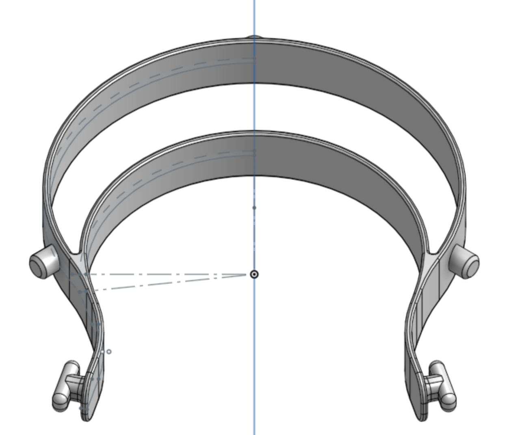
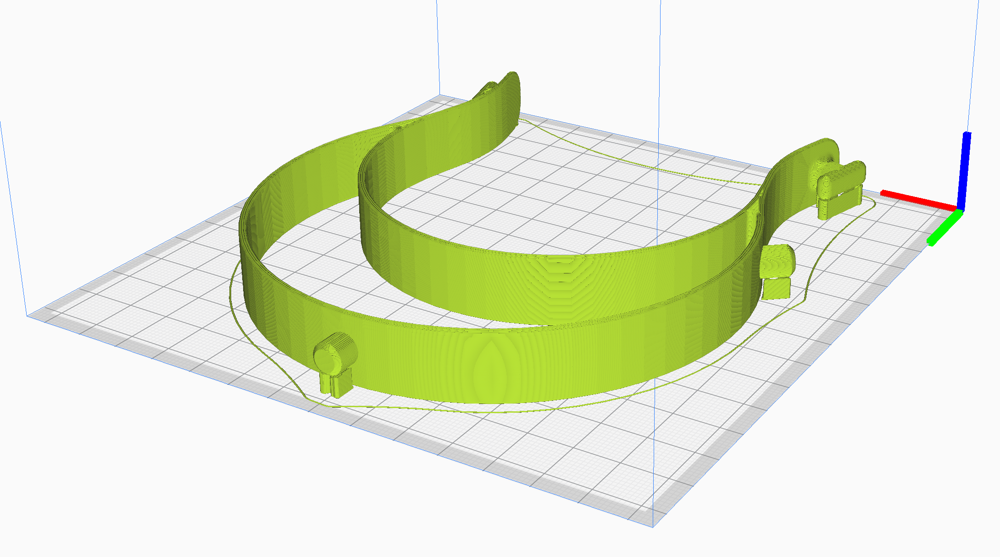

# Face Shields

Face shields are [recommended by the CDC when using no mask or an improvised mask](https://www.cdc.gov/coronavirus/2019-ncov/hcp/ppe-strategy/face-masks.html). So they will probably be in very high demand once hospitals begin to run out of masks.

Prusa has a [great face shield design](https://blog.prusaprinters.org/from-design-to-mass-3d-printing-of-medical-shields-in-three-days/), as does [Budmen Industries](https://budmen.com/). It seems like Budmen is a good platform to coordinate through, though I would prefer to talk straight to local hospitals and nurses so that I can produce the highest impact goods.

The basic design will be the same as others are doing: a 3D-printed headpiece secured by elastic, which holds a transparent sheet by means of three holes in the sheet.

I wish I could just use the Budmen design, but it will not fit in my print bed. I have created a clone of the Prusa RC1 design with slight changes to improve ergonomics and to suit my process.

## Capital equipment

* [X] FDM printer with 130mm x 130mm bed
* [X] [Standard three hole punch](https://www.amazon.com/Swingline-Precision-Adjustable-Capacity-74037/dp/B0006HUPHU) (or single hole punch + jig)

## Consumables

* [X] [ABS plastic](https://www.amazon.com/gp/product/B00J0H6NNM) (16g per part, or 21g with raft) (white preferred to show contamination)
* [X] [Overhead transparency film](https://www.amazon.com/gp/product/B07F45YXJD) (1 sheet)
* [X] [Elastic strap for back](https://www.amazon.com/gp/product/B07KSRCLKK) (9 inches if tying knots at the ends)
* [X] [Gallon ziploc bag](https://www.amazon.com/gp/product/B07BJ495GL) (packaging for final product and prevent contamination) (1 bag)

*Note: These are all links to Amazon. I have acquired the materials locally when possible. I have also put in an order for a larger quantity of supplies, but deliveries are quite slow right now. I was able to get the transparency sheets and elastic cord from [Blick art supplies](https://www.dickblick.com/) who were wonderful and took my order over the phone and handed it to me outside their storefront.*

## Design

* [Onshape Link](https://cad.onshape.com/documents/dcd6ca254672a123c702e56e/w/8bd6e5bff2b92adb0a930074/e/4d12b3a488c49a6203e14760)
* [Download STL](face_shield_headband.stl)

## Manufacturing

I can only fit one part on my 3D printer at a time. The bottom surface is unimportant so a raft is probably not necessary. Maybe I can stack them vertically.

## Sterility concerns

There isn't really hope of creating a truly sterile environment, but I will wash my hands, and use gloves and a face shield to pack each item into individual ziploc bags.

I was originally going to bake the product at a [low temperature](https://www.who.int/csr/sars/survival_2003_05_04/en/) in its final packaging, but it seems like all of the parts *except the plastic ziploc bag* can withstand baking at 100°C.

## Production Goals

My goal is to produce around 200 units, but this may change after making initial deliveries and getting feedback on current needs.

So far I have donated 18 face shields to Cambridge Hospital, and have many more headbands ready to be assembled transparent shields.
