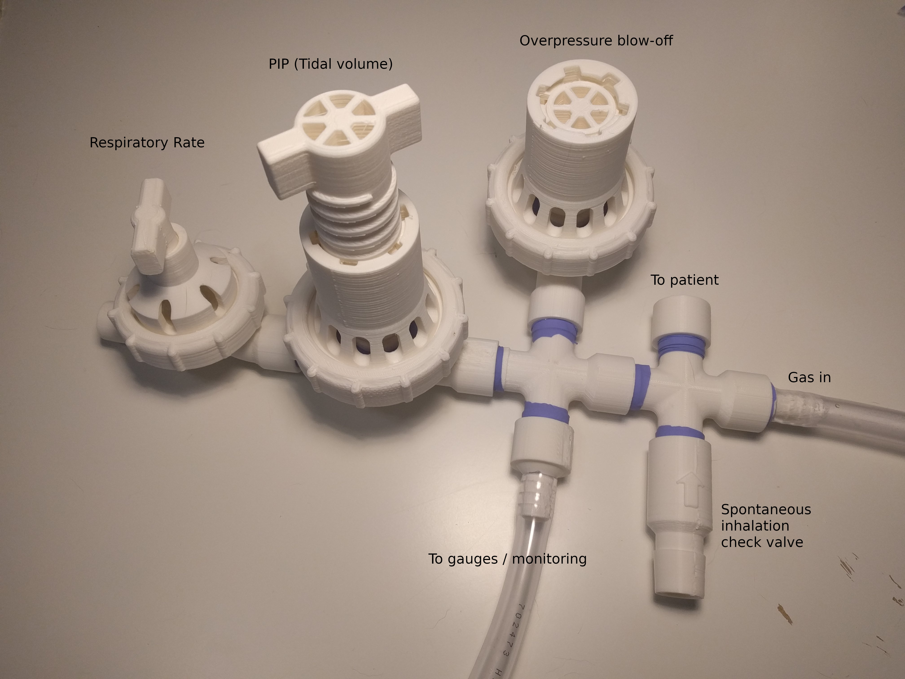
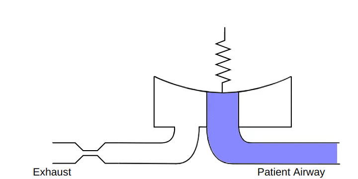
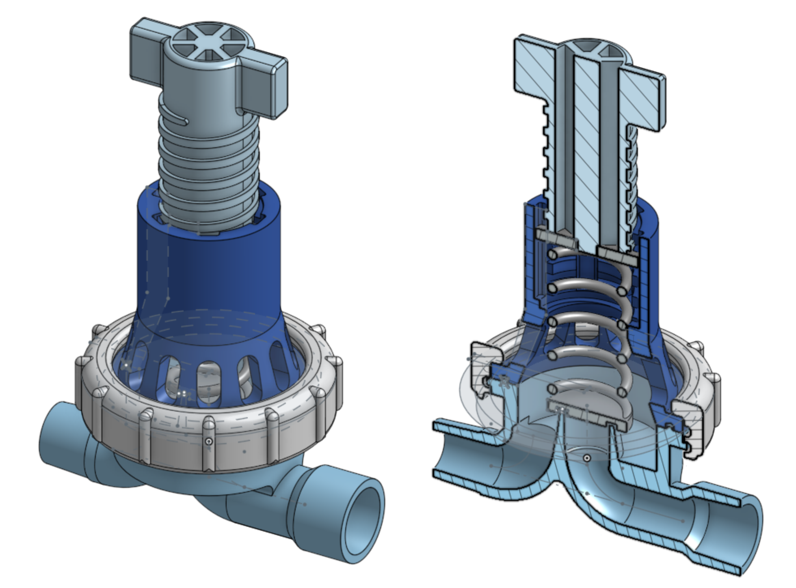
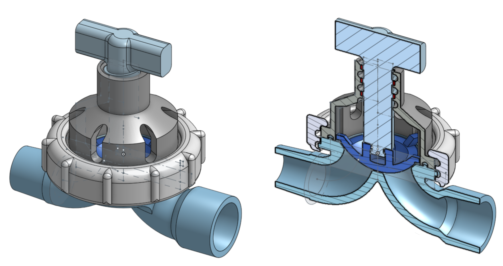
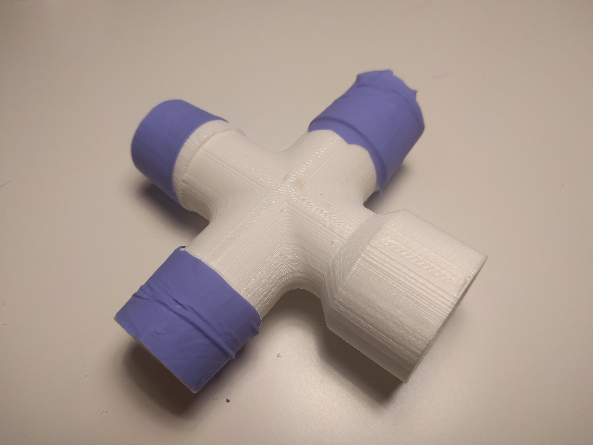
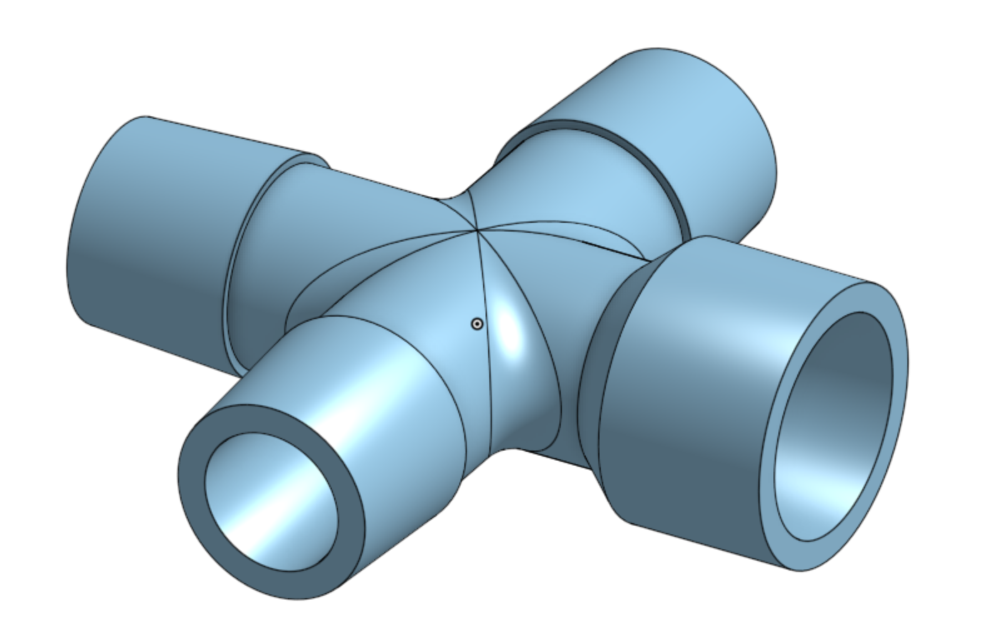
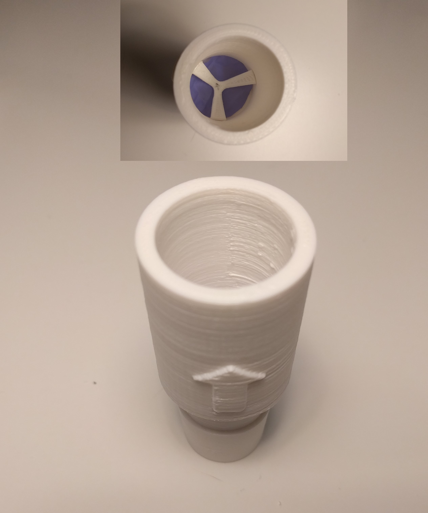
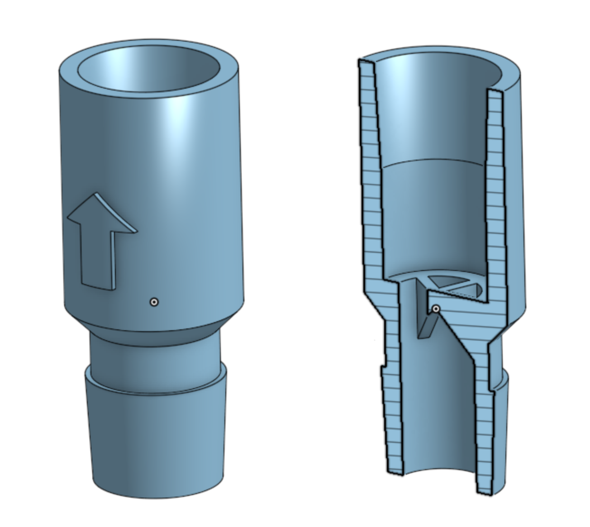

# Ventilators

These are designs for a fully mechanical 3D-printed emergency ventilator.

Every part is 3D printed except for a few diaphragm membranes, which can be made out of a disposable glove in a pinch.

With the parts shown here, it will provide mechanical ventilation when connected to a gas source and a patient mask or ET tube.

This is still just a proof-of-concept / reference design, and needs additional work before it can be brought into production or used in hospitals.
I do not have the resources, time, or expertise to take these next steps, so I am publishing this design as-is with the hopes that
some of the groups around the world who are working on making ventilators might use it or learn from it.

The design incorporates the following:

* Adjustable PIP / tidal volume
* Adjustable respiratory rate
* PEEP proportional to PIP
* Adjustable blow-off valve for overpressure
* Check valve for spontaneous inhalation
* Exhaust ports that can be attached to an air filtration system
* Operation in mandatory mode or assist mode

The design does not incorporate the following:

* Pressure gauge
* Flow gauge
* Alarms or monitoring of any kind (non-cycling, overpressure, underpressure)

Due to this ventilator's modular design, sensors and gagues can can be easily attached to the manifold.

## Design principles

An emergency ventilator that shares a very similar design is the [GO2VENT](https://www.vortran.com/go2vent).

Cyclic ventilation comes from a bistable diaphragm valve. This valve seals until the pressure reaches a certain point, after which it opens.
The valve will remain open until the pressure drops to a much lower value at which point it will close again.

The opening point is set by a spring and screw knob. The closing pressure is always some fraction of the opening pressure.
The design sets it at 1/5 but this may vary depending on construction.

This ventilator design attaches to a constant flow air source. The air flow fills the patient's lungs and builds pressure against the closed diaphragm valve.
Once the PIP is reached, the diaphragm valve opens to exhaust the air.
The rate of air exhaust can be adjusted to change the respiratory rate.
When the pressure has dropped sufficiently (PEEP), the valve will close and the cycle will repeat.

Although the system is pressure-driven, it gives adjustability over several key parameters:

* Respiratory rate is set by incoming gas flow rate and exhaust valve flow rate
* Tidal volume is set by the PIP knob
* I/E ratio is set by the exhaust valve

Assist mode can be achieved by closing the exhaust valve right to the point where the device stops cycling (but not to the point where the blow-off valve activates.)
The main valve will be open all the time. When the patient takes a breath, the drop in airway pressure will close the main valve,
providing breath assistance up until the valve re-opens at the PIP. If the patient wishes to inhale faster than the gas flow rate, a check valve will open for unimpeded breathing.

## Design

The complete design is available on Onshape and falls under the [license included with this repository](LICENSE) (Public Domain.)

STLs can be exported using this Onshape link, but be aware that this design is not production-ready. You will almost certainly need to modify some parts to make it work for your application.

**[Complete CAD on Onshape](https://cad.onshape.com/documents/b7af994e19fe6edf1247d484/w/5f857798f59f293bc3ef7dbf/e/6c178ba4f8bcedf65bc09a27)**

### Pressure valve

[Onshape link to pressure valve](https://cad.onshape.com/documents/b7af994e19fe6edf1247d484/w/5f857798f59f293bc3ef7dbf/e/6c178ba4f8bcedf65bc09a27)

This valve design is used as both the main bistable valve that performs ventilation, as well as the emergency blow-off valve.
If no back-pressure is provided through a flow reducer, it will act as a pressure regulator.
It is made of six parts:

* Main body (bottom)
* Top
* Diaphragm (non-3D printed)
* Screw ring, to hold top and bottom together and sandwich the diaphragm
* Spring, to apply force to the diaphragm
* T-handle, to adjust the spring force

The main body must be airtight and has many critical surfaces for proper sealing.
On an FDM printer, it must be printed with supports, ideally with the diaphragm interface oriented upwards.
Note that FDM does not usually produce airtight parts, so post-processing or another technology should be used here.

The top and T-handle do not need to be airtight and can be made using FDM. The T-handle and top do not need support material.

The spring can be finnicky to get right. You may have to vary the diameter to get the desired range of PIP. 
The dimensions given here are a good starting point for an FDM process. Supports are required, and it is easy to break in the cleaning process.
It is important to thoroughly clean support material from the spring, so that it does not bind or stick when in use.

The diaphragm can be made from the flat part of a disposable glove (the palm area.) It can be sandwiched into the assembly and then the extra trimmed off.
The design is not very sensitive to its final shape.

The spring and T-handle can be replaced without breaking the circuit.

### Flow valve

[Onshape link to flow valve](https://cad.onshape.com/documents/b7af994e19fe6edf1247d484/w/5f857798f59f293bc3ef7dbf/e/d7e7e5226cf2abbd1ccad349)

This valve design is very similar to the main bistable valve, but is smaller and is more of a classical diaphragm valve design.
It has six parts:

* Main body (bottom)
* Top
* Diaphragm (non-3D printed)
* Screw ring, to hold top and bottom together and sandwich the diaphragm
* Plunger, to press down on the diaphragm
* T-handle, to adjust the plunger displacement

The main body must be airtight and has many critical surfaces for proper sealing.
On an FDM printer, it must be printed with supports, ideally with the diaphragm sealing surface oriented upwards.
Note that FDM does not usually produce airtight parts, so post-processing or another technology should be used here.

The top and T-handle do not need to be airtight and can be made using FDM. The T-handle and top do not need support material.

The plunger can be made with FDM using supports.

The diaphragm can be made from the flat part of a disposable glove (the palm area.) It can be sandwiched into the assembly and then the extra trimmed off.
The design is not very sensitive to its final shape.

### Splitter

[Onshape link to splitter](https://cad.onshape.com/documents/b7af994e19fe6edf1247d484/w/5f857798f59f293bc3ef7dbf/e/2668b375a7b99ab02ccbbc9c)

The splitter acts as the manifold for the system. Splitters can be chained together to attach additional gauges or monitoring equipment.

The splitter must be airtight and has many critical surfaces. FDM is not recommended.

To improve sealing of the connections, the fingers of a disposable glove can be cut into rings and put over the tapers.

### Check valve

[Onshape link to check valve](https://cad.onshape.com/documents/b7af994e19fe6edf1247d484/w/5f857798f59f293bc3ef7dbf/e/4857d81d67953809a8af69f8)

The check valve allows for spontaneous inhalation. It has three parts:

* Main tube
* Diaphragm (non-3D printed)
* Retainer

The main tube must be airtight and has critical surfaces. It can be FDM printed without supports, but FDM is not recommended.

The diaphragm can be cut from a smal section of glove. The final shape is much more important here than with the diaphragm valves.

Once the diaphragm is in position, the retainer can be press-fit into the tube to hold the diaphragm in place.

### Additional adapters

[Onshape link to adapters](https://cad.onshape.com/documents/b7af994e19fe6edf1247d484/w/5f857798f59f293bc3ef7dbf/e/b70ecbe6d4da3a12c3912c5a)

You will probably need to design additional components to interface with your gas source, patient, gauges, and monitoring equipment.

Provided are male and female plugs, as well as male and female adapters to hose barbs for 1/2" ID tubing.

These have critical surfaces and must be airtight, so FDM is not recommended.
